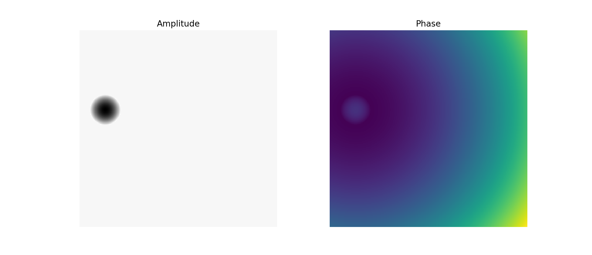
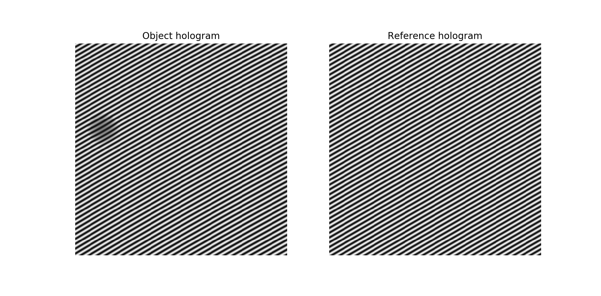

.. _holo-sim:

Hologram simulation
===================

Holograms can be simulated using the method described by Lichte et al.
:cite:`Lichte2008` The simulator includes simulation of holograms with Gaussian
and Poisson noise, without effect of Fresnel fringes of the biprism. The
simulator requires amplitude and phase images being provided. Those can be
calculated as in example below in which for amplitude a sphere is assumed, the
same sphere is used for the mean inner potential (MIP) contribution to the
phase and in addition to the quadratic long-range phase shift originating from
the centre of the sphere:

.. testsetup:: *

    from libertem import api
    from libertem.executor.inline import InlineJobExecutor

    ctx = api.Context(executor=InlineJobExecutor())

.. testcode::

   import numpy as np
   import matplotlib.pyplot as plt
   from libertem_holo.base.generate import hologram_frame

   # Define grid
   sx, sy = (256, 256)
   mx, my = np.meshgrid(np.arange(sx), np.arange(sy))
   # Define sphere region
   sphere = (mx - 33.)**2 + (my - 103.)**2 < 20.**2
   # Calculate long-range contribution to the phase
   phase = ((mx - 33.)**2 + (my - 103.)**2) / sx / 40.
   # Add mean inner potential contribution to the phase
   phase[sphere] += (-((mx[sphere] - 33.)**2 \
                      + (my[sphere] - 103.)**2) / sx / 3 + 0.5) * 2.
   # Calculate amplitude of the phase
   amp = np.ones_like(phase)
   amp[sphere] = ((mx[sphere] - 33.)**2 \
                  + (my[sphere] - 103.)**2) / sx / 3 + 0.5

   # Plot
   f, ax = plt.subplots(1, 2)
   ax[0].imshow(amp, cmap='gray')
   ax[0].title.set_text('Amplitude')
   ax[0].set_axis_off()
   ax[1].imshow(phase, cmap='viridis')
   ax[1].title.set_text('Phase')
   ax[1].set_axis_off()

To generate the object hologram, :code:`amp` and :code:`phase` should be passed to the :code:`holo_frame`
function as follows:

.. testcode::

   holo = hologram_frame(amp, phase)

To generate the vacuum reference hologram, use an array of ones for amplitude and zero for phase:

.. testcode::

   ref = hologram_frame(np.ones_like(phase), np.zeros_like(phase))

   # Plot
   f, ax = plt.subplots(1, 2)
   ax[0].imshow(holo, cmap='gray')
   ax[0].title.set_text('Object hologram')
   ax[0].set_axis_off()
   ax[1].imshow(ref, cmap='gray')
   ax[1].title.set_text('Reference hologram')
   ax[1].set_axis_off()

